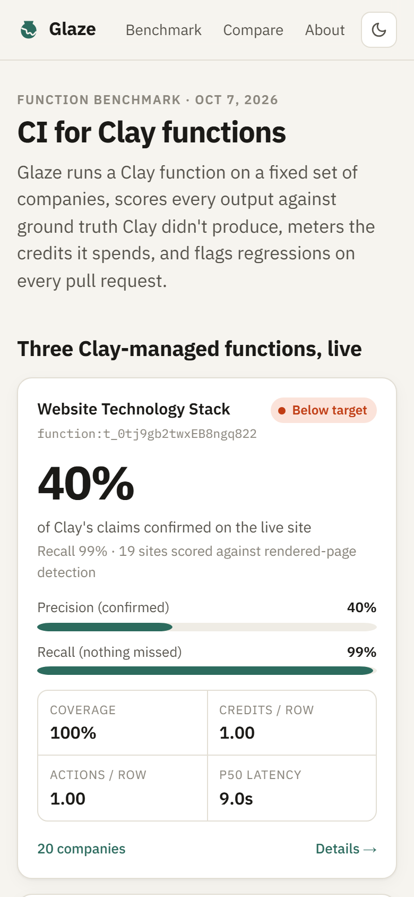
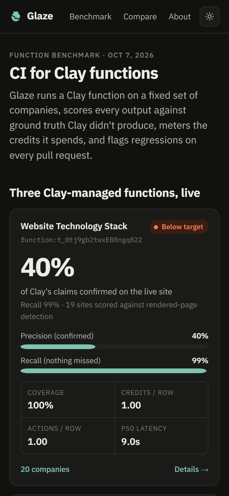
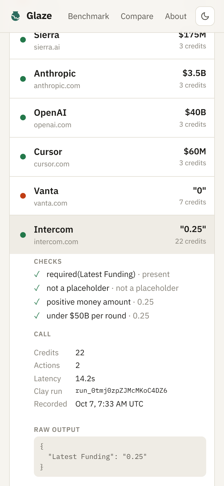
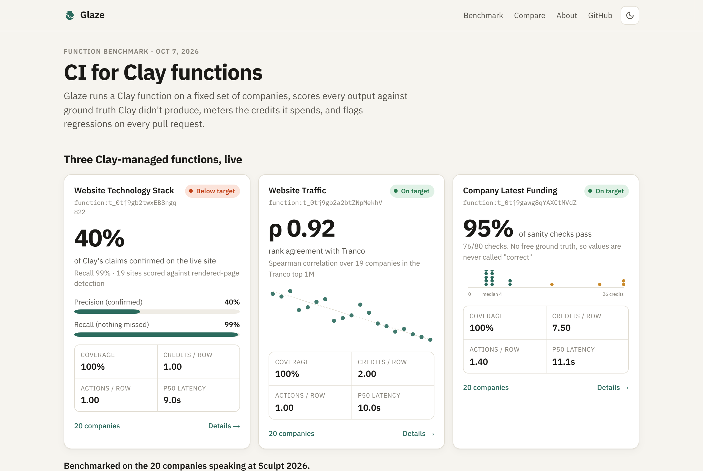
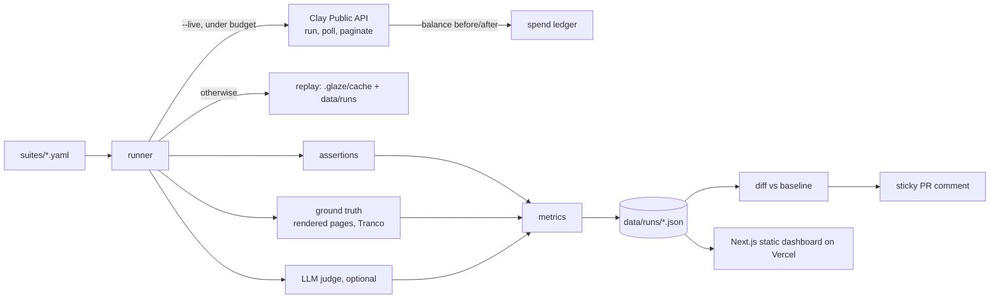

# Glaze

**CI and benchmarking for Clay functions.** Glaze runs a Clay function on a fixed set of companies, scores every output against ground truth Clay didn't produce, meters the credits each row costs, and comments on every pull request when something regresses.

**Dashboard:** https://glaze-xi.vercel.app  ·  **[See it catch a regression →](https://github.com/zaki-m-khan/glaze/pull/1)**

<p>
  
  
  
</p>



## Why

GTM teams wire Clay functions into tables, workflows and agents, but nobody tests them. When a provider's coverage drops, a waterfall returns junk, or someone edits a Claygent prompt, the damage surfaces weeks later as bad emails and wasted credits. Glaze treats a function like code: a fixed test set, checks that run on every change, and a diff against the last known-good run.

## The benchmark (live, Oct 7 2026)

Three Clay-managed functions, run through the Clay Public API on the 20 companies speaking at Clay's Sculpt conference. One row per run, so every credit is attributed to a single company.

| Function | Coverage | Accuracy vs independent truth | Credits / row | Actions / row | p50 / p95 latency |
|---|---|---|---|---|---|
| Website Technology Stack | 100% | **precision 40% (90/226), recall 99% (90/91)** vs Glaze's own rendered-page detection, 19 sites | 1.00 | 1.00 | 9.0 s / 16.7 s |
| Website Traffic | 100% | **Spearman ρ = 0.92** vs Tranco top-1M rank (list `26Y29`, n = 19) | 2.00 | 1.00 | 10.0 s / 16.4 s |
| Company Latest Funding | 100% | **95% of sanity checks pass** (76/80); no free ground truth, so no "correct" values are claimed | 7.50 (range 3–26, median 4) | 1.40 | 11.1 s / 29.3 s |

What the runs show:

- **Tech stack:** Clay caught almost everything Glaze saw (it missed only Meta Pixel on clay.com), but most of what it reports couldn't be confirmed on the live homepage. Stripe.js is listed on 17 of 19 sites, Segment on 13, Fastly on 11. The data is domain-wide and historical, so precision is a lower bound: use it for "has used X", not "runs X today".
- **Traffic:** ordering agrees strongly with Tranco. The biggest disagreement is anthropic.com, #11 by Clay's traffic and #6 by Tranco among these 19.
- **Funding:** clay.com and vanta.com return `"0"`. The three most expensive rows (intercom 22 credits, bill.com 26, hubspot 26) return `0.25`, `2.1` and `5`, numbers that lost their unit. The baseline suite misses those; [the demo PR](https://github.com/zaki-m-khan/glaze/pull/1) adds a check, and the bot flags them.

Building the benchmark cost **210 data credits and 68 actions** (budgets: 250 and 150), measured from balance deltas that match Clay's balance exactly. Every number above comes from [`data/runs/`](data/runs) and [`data/truth/`](data/truth).

## Quickstart

Node 24. Replay mode needs no key and spends nothing:

```bash
git clone https://github.com/zaki-m-khan/glaze && cd glaze
npm ci
npx glaze run suites/tech-stack.yaml      # replays recorded Clay outputs, re-scores, prints a table
npx glaze diff --replay                   # re-score every suite and diff against the baselines
npm test
```

`npm run glaze -- <command>` is equivalent. To run live, copy `.env.example` to `.env.local`, set `CLAY_API_KEY`, `CLAY_CREDIT_BUDGET` and `CLAY_ACTION_BUDGET`, and add `--live`:

```bash
npx glaze run suites/traffic.yaml --live --limit 5
```

| Command | What it does |
|---|---|
| `glaze run <suite> [--live] [--limit N] [--fresh] [--chunk-size N] [--json]` | Run, score, and write a run record |
| `glaze baseline <run-id>` | Mark a committed run as its suite's baseline |
| `glaze diff [--suite s] [--replay] [--fail-on regressions] [--format text/markdown/json]` | Diff the latest runs against baselines (CI uses this) |
| `glaze rescore <run-id>` | Re-apply current checks and truth to a recorded run, no Clay calls |
| `glaze compare <suite> --a <routine> --b <routine> [--live]` | Two function versions head to head, judge-scored |
| `glaze truth refresh [--static]` | Rebuild the ground truth (free) |
| `glaze report [run-id]` | Print a run |

## A suite

```yaml
name: funding
title: Company Latest Funding
function:
  name: Company Latest Funding
  routineId: function:t_0tj9gawg8qYAXCtMVdZ
rows: golden-companies.yaml          # the 20 Sculpt companies
inputs:
  Company Domain: $domain            # Clay input name → company field
estimate: { creditsPerRow: 7, actionsPerRow: 2 }   # used for the pre-run budget check
checks:
  - { type: required, field: Latest Funding }
  - { type: custom, fn: no-placeholder, field: Latest Funding, name: not a placeholder }
  - { type: range, parse: money, field: Latest Funding, min: 0, exclusiveMin: true, name: positive money amount }
judge:
  - field: Latest Funding
    rubric: The value is internally consistent and usable as this company's most recent round.
truth: none                          # or html-signatures / tranco, with truthField
targets: { coverage: 0.9, accuracy: 0.8 }
regressions: { coverageDrop: 0.05, accuracyDrop: 0.05, costIncrease: 0.1 }
```

Check types: `required`, `type`, `enum`, `regex`, `range` (numbers or money like `$1.2B`), `date`, and named `custom` checks.

## How it works



- **Clay client** (`src/lib/clay.ts`): `POST /routines/{id}/run`, poll `GET /routines/run/{id}/results` through 202s, paginate by cursor. 429s are retried with `Retry-After` plus jitter; 5xx and network errors only on GETs, because retrying a run that may have started would charge twice. Errors are typed (`ClayAuthError`, `ClayRateLimitError`, `RunTimeoutError`, …).
- **Metering:** Clay doesn't report what a run cost, so Glaze reads `/credits/balance` before each run and waits for it to settle afterwards. With one row per run (the default), credits, actions and latency are exact per company.
- **Budgets:** live spend needs `--live`. Before each row Glaze checks the estimate against `CLAY_CREDIT_BUDGET` and `CLAY_ACTION_BUDGET` (both default to 0) and stops, falling back to replay, rather than cross either one.
- **Cache and replay:** every call is stored by routine and input hash in `.glaze/cache/`, and every live run's outputs are committed in `data/runs/`, so a fresh clone and CI can re-score everything without a key.
- **Ground truth Clay didn't produce:**
  - *Tech:* each homepage is rendered in headless Chromium, and 20 technology signatures are matched against the DOM, every network request and the response headers (`src/lib/truth/`). Bot walls are marked unverifiable and left out.
  - *Traffic:* ranks come from a pinned Tranco list.
- **CI:** `ci.yml` runs typecheck, lint, tests, build and a replay from a clean checkout. `glaze-check.yml` runs on PRs that touch suites, data or scoring code: it replays, diffs against baselines, posts or updates one comment, and fails on regressions.

## Limitations

- 20 well-known companies is a demo-sized set, not a random sample of what GTM teams enrich.
- Tech truth sees one homepage, once, as a US visitor who hasn't answered a cookie banner. Tags on other pages, subdomains or behind consent are invisible, so precision is a lower bound, and recall covers only the 20 detectable technologies.
- Tranco ranks popularity, not visits, so only ordering is compared. gonimbly.com isn't in the top 1M.
- Balance-delta metering assumes nothing else in the workspace spends during a run.
- The LLM judge and the live compare demo weren't run: no Anthropic key or second function version was configured. Both are implemented and unit-tested with fixtures.
- Provider data drifts. A live re-run can differ from the baseline without anything being broken, which is why CI replays instead.

## Development

```bash
npm run dev                      # dashboard on localhost:3000
npm run typecheck && npm run lint && npm test && npm run build
bash scripts/secret-scan.sh      # run before every push
npx tsx scripts/screenshots.ts   # README screenshots (needs the dev server on :3217)
```

Design decisions and their reasons are in [DECISIONS.md](DECISIONS.md).
